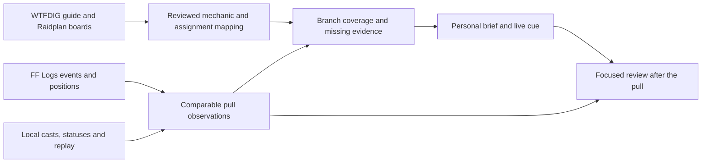

# Shikari 1.0 readiness and intelligence plan

Reviewed 10 September 2026 against v0.9.5 (`bb6a5c4`). Local development branch: `codex/launch-readiness`.

**Recommendation:** make 1.0 the release where Shikari's personal guidance becomes dependable and easy to understand. Finish the performance and recovery work below, then prove one complete encounter workflow before broadening automatic inference. Keep the present imports, editor, replay, mini window, and Ember as the foundation.

This pass includes code fixes and regression coverage. It does not publish a release or change the advertised version. The remaining steps are a proposed implementation order, not completed features.

## Verification completed

- Release build: zero warnings and zero errors against the installed Dalamud SDK.
- All 35 CI regression scripts passed, including the native ImGui input check and imported Act 1 symbol fixture.
- After final review corrections, the release build and all five affected replay/strategy suites passed again. Replay now has 42 assertions; the FF Logs harness has 67 checks.
- New failure cases were reproduced before their fixes. Independent review also checked status lifecycle, cast pagination, authored-call preservation, replay retention ordering, and the release gate.
- Workflow YAML and the local reusable-workflow dependency were checked locally. A GitHub run of the new release gate remains pending publication.
- Live FFXIV performance, actual raid accuracy, and authenticated live API behavior were not tested in this pass. HTTP regressions use controlled responses; UI coverage includes stubs and a native ImGui input harness.

## What this pass changes

| Area | Finding and resulting behavior |
| --- | --- |
| Reminders between pulls | The idle combat clock could trigger a zero-time opener while waiting in duty. Automatic calls now require combat; manual Test, speech preparation, and overlay expiry still work while idle. |
| Disabled calls | A queued cast call could fire after its timeline entry was disabled. Delivery now rechecks the entry. |
| Status evidence | A full FF Logs status removal without a source could leave an earlier application active, produce an assignment draft, and incorrectly reproduce that draft during review. Unknown-source full removals invalidate possible sources; a known-source removal preserves genuinely separate sources. Stack updates keep their own semantics. |
| Incomplete cast history | The cast reader could silently stop at its page limit or return an empty history for an unreadable page. It now rejects incomplete or malformed pagination, keeps fractional cursors precise, and accepts a properly completed final page. |
| Authored live calls | Name-matched evidence could change an already-enabled clock call into a boss-cast trigger. Enrichment now preserves enabled entries while attaching observations; it fills missing anchors only on inactive drafts. |
| Missing cast endings | An unpaired FF Logs cast start could establish a destination at the start itself. It remains usable as a start anchor but cannot establish an end-time destination or automatic assignment draft. The reference UI identifies the expected comparison time and does not claim verified effect timing. |
| Replay recovery | A failed replacement save could still delete the last durable replay during retention cleanup. Cleanup now operates on successfully persisted recordings. Invalid or unsupported startup files do not consume the slots for readable recordings and remain available for recovery. |
| Runtime allocations | Reminder history uses tuple keys instead of allocating a string for each check. Replay trails use a unique-player lookup without creating an iterator and array for every sample. |
| Release process | The release workflow now requires the complete reusable build/test workflow at the tagged source before publishing or notifying the plugin-list aggregator. |

Relevant source areas are `ReminderEngine`, `ReplayPlayback`, `ReplayStore`, `EvidenceTimeline`, `AdaptiveEngine`, `FfLogsClient`, `StrategyEnrichment`, the strategy reference UI, and the build/release workflows.

## Performance evidence

The runtime benchmark compiles the actual baseline/current classes with game dependencies replaced by test doubles. It warms the measured path and uses the managed allocation counter. These are isolated measurements, not FFXIV frame timings.

| Synthetic workload | Before | After |
| --- | ---: | ---: |
| One reminder update, 256 future timer entries | 24,576 bytes allocated | 0 bytes allocated |
| One eight-player replay-trail draw, five seconds at 10 Hz | 52,928 bytes allocated | 9,856 bytes allocated |

The trail change removes 81.4% of allocations in that measured path. Returned trail lists still allocate. This is not an 81.4% improvement to the whole plugin or game.

A separate synthetic ten-minute, eight-player recording contains 6,000 board frames and 48,000 world positions. `ReplayStore.SaveEvidence` spent approximately 149–453 ms on the caller and allocated 44.2 MiB in three warmed runs; its serialized file was about 6.2 MiB. The caller cost includes validation and JSON creation, while the durable file write is queued separately. Machine load affects these timings, but the synchronous work is unambiguously on the calling thread. A completed accepted pull currently requests two replay snapshots, making this a priority before 1.0.

Other inspected guardrails already help: combat/status sampling is normally 100 ms, replay duration and sample counts are bounded, party rendering is limited to eight players, unknown alignment prevents destination claims, imported adaptive drafts stay disabled, and late import results are checked against the strategy they started with.

## First: finish the performance and reliability foundation

### 1. Move heavy pull-finalization work off the game thread

**Files:** `ReplayStore`, `StrategyMergeSession`, `StrategyEnrichment`, `PlanStore`, and their integration tests.

- Transfer ownership of a finished immutable recording to a worker; do not queue a mutable object and hope it stays unchanged.
- Compute enrichment against the captured strategy on that worker, then apply the small result on the framework thread only if the active plan and its revision still match.
- Serialize the final linked recording once. Keep ordering between saves, deletion, retention, and shutdown; surface write failures and preserve the prior durable copy.
- Coalesce editor autosaves and move durable plan writes off the UI thread using immutable snapshots, revision acknowledgements, and explicit error/retry state. `AtomicFile.Flush(true)` is currently reached synchronously by plan autosaves and accepted enrichment.
- Keep the application responsive if disk storage is slow, unavailable, or full. Do not loosen the atomic replacement guarantees to gain speed.

**Acceptance:** slow-disk and injected-failure tests preserve the last saved plan/replay; rapid edit/save/delete sequences cannot resurrect content; changing plans while enrichment runs cannot apply stale results. Measure the framework callback separately from worker serialization. Profile pull start and wipe end in game, including a large imported strategy and a long recording.

### 2. Publish the action index safely

**File:** `ActionIndex`; callers include `SpellPicker`, the roster, `EncounterMonitor`, and `ReplayStore`.

Index construction modifies dictionaries on a worker. Several public lookup methods can read them before construction completes; only search consistently checks readiness. This is a verified code-level concurrency exposure, not a reproduced in-game crash.

Build into private collections and atomically publish a complete read-only snapshot. Before publication, callers should receive the established loading/fallback values. Cancellation should end construction before plugin services are released.

**Acceptance:** a controlled test holds construction mid-build while every public lookup executes repeatedly; none enumerates or reads a collection being mutated. Reloading during a pull must remain responsive and use fallbacks until the complete index is published.

### 3. Reduce duplicate snapshots and bound loaded replay memory

**Files:** `AdaptiveService`, `BuddyService`, `ReplayBuffer`, `ReplayStore`.

Adaptive, Ember, and replay currently make separate whole-plan copies at pull start. Share an immutable rules/assignment snapshot where possible; preserve replay's historical board snapshot. Profile this before adding another analysis consumer.

Replay retention currently limits the number of recordings, not the total memory occupied by their deserialized graphs. There is a 32 MiB per-file limit and a configurable maximum of 30 recordings; loading all retained details can still be expensive. Store a lightweight catalog and load full recordings on demand, with a bounded cache for active comparison jobs. Preserve incompatible files for recovery and make storage usage visible.

**Acceptance:** memory stabilizes during a long session with the maximum retained corpus; evicting cached data does not discard recordings or invalidate a running analysis. Loading one replay should not require fully parsing every retained pull.

### 4. Cache arena draw order only after profiling confirms the gain

**File:** `ArenaCanvas`.

Main, mini, and review views sort slide items for each draw. A draw-order buffer can avoid repeated sorting of an unchanged board. Invalidate it for imports, undo/redo, layer changes, insertion/deletion, and view mode changes; retain stable ordering for equal layers. Moving a token alone should not require a sort.

**Acceptance:** crowded imported slides render identically after all edit operations. Measure allocation and CPU cost at several item counts; avoid introducing a cache that displays stale mechanics.

### 5. Exercise startup failure and learned-data recovery

**Files:** `Plugin`, `ActionIndex`, `EncounterLearner`.

The plugin installs workers and event subscriptions before all constructors finish, but has no initialization rollback scope. Some disposal method-group expressions assume their service was constructed. A later initialization exception could leave an earlier resource registered. This is a control-flow finding; reproduce it with fault injection before choosing the cleanup implementation.

Learned timing history still uses direct `File.WriteAllText`. Use the existing atomic replacement approach to preserve the previous history on a failed write, with the same immutable snapshot/acknowledgement design when moving persistence to a worker.

**Acceptance:** inject a failure after each startup resource is acquired and verify hooks, windows, and workers are released exactly once. Interrupted learned-history writes preserve the previous readable file. Bound startup scanning of rejected recordings without deleting them; the current recovery fix examines every candidate file to distinguish valid surplus recordings from files that must be preserved.

## Next: turn gathered data into useful personal guidance

The key distinction is between an authored strategy, an observation, and a rule that has been reviewed for live use. FF Logs and local capture supply observations. They do not inherently know that a dragon symbol means one assignment, that a guide picture is just an example, or that a nearby player resolved the mechanic correctly.

### 1. A personal mechanic brief backed by a reviewed strategy mapping

Build this first as a complete workflow for M12S Caro, using the exact imported Grotesquerie boards that motivated the feature. Then generalize the mapping tools.

Today the importer can retain boards and match unambiguous names or phase labels. A phase containing several boards still needs an explicit connection between each status branch and its intended board. More aggressive name matching cannot reliably supply that meaning.

Add a reviewed encounter package containing encounter/difficulty/patch identity, guide variant, original board step, action and occurrence, status conditions, roster assignment, short instruction, and an explicit unknown/conflict result. Use existing adaptive rules and imported provenance as the foundation rather than creating another independent rule system.

The player's flow should be:

1. Import the chosen strategy and a log.
2. See the selected role and the mechanics Shikari can explain, plus a specific next action for missing information such as an unmatched seat or unaligned board.
3. Review the small set of inferred mechanic/branch mappings in one place.
4. During a pull, receive one short instruction from the same resolved decision in the mini window and Ember.

A sample instruction would be “You have the short timer — use your assigned east spot.” That is illustrative text, not a claim about the actual Caro solution. The real instruction must come from the selected reviewed strategy. When the decision cannot be established, show the guide context and the missing condition instead of a guessed destination.

**Acceptance:** replay previously unseen pulls for every supported branch; include duplicate jobs, simultaneous statuses, late observations, status loss, variant changes, and conflicting conditions. The player should understand which mechanic is covered and what needs setup without opening several import screens. An enabled call must never change because an additional source was imported.

### 2. Coverage across independent pulls, with actionable readiness

The existing coverage tool counts recordings and already discloses that a local recording and an FF Logs reference may describe the same pull. Do not turn that count into a confidence percentage.

Extend source identity with report absolute start time, fight-relative timing, local pull time, encounter, and a cast-sequence fingerprint. Where matching is ambiguous, retain an explicit same-pull link rather than silently merging two attempts. Key analysis to the strategy variant, rule revision, and board geometry.

Present readable evidence such as “Both branches seen across six separate pulls; one player mapping still unresolved.” Separate readiness dimensions: encounter match, seat match, status identification, board alignment, branch coverage, and conflicts. The next-action control should open the exact missing setup or observation.

**Acceptance:** repeated imports count once; local/log captures of the same known pull count once; similar but separate pulls remain separate; changing a rule, assignment, or board invalidates the affected assessment. Keep examples used to draft a rule separate from pulls used to evaluate it. No tested-pull count alone should enable a rule.

### 3. A focused personal review using observed effect timing

Preserve observed cast completions separately from predicted cast-bar/clock times. Add narrowly useful damage, death, and status-resolution observations where the source actually provides them. The existing FF Logs evidence query requests all event types with resource data, but the parser currently retains a smaller status/position subset.

Start with a concise review: the instruction shown, the observed status, the player's last fresh position at the chosen comparison event, and one useful thing to inspect. A mechanic-specific verdict requires an explicit definition of success/failure for that mechanic. A kill, survival, cast disappearance, or proximity to a token is insufficient by itself.

Record which cue was actually displayed and when, so review can distinguish a missing assignment, an incorrect mapping, a late cue, and a player's movement after receiving it. Keep this private by default and preserve the current separation between local recordings and shared anonymous summaries.

**Acceptance:** missing events and stale positions remain unknown; interrupted casts never become completed effects; replay seeking is deterministic; delayed damage, untargetable phases, wipes, and multi-source statuses do not produce invented explanations. Display actual and expected timing as separate concepts.

## API opportunities and limits checked against current documentation

- FF Logs exposes report absolute timestamps and revision, paginated events, source/target filters, and optional resource details. This supports pull identity, cache invalidation, and focused queries. Its documentation explicitly says event data can change; import fixtures and completeness checks remain necessary. Resource detail adds substantial bandwidth, so retrieve and cache it deliberately. [FF Logs Report schema](https://www.fflogs.com/v2-api-docs/ff/report.doc.html)
- Fight metadata includes encounter identity, phase transitions, maps, in-progress state, and completion information. These are useful candidates for phase reconciliation and for avoiding an analysis based on a report that is still uploading. They do not determine the meaning of a chosen strategy's branches. [FF Logs ReportFight schema](https://www.fflogs.com/v2-api-docs/ff/reportfight.doc.html)
- Dalamud exposes cast and status snapshots; cast display timing should not be treated as proof of an effect resolving. [Dalamud battle-character API](https://dalamud.dev/api/Dalamud.Game.ClientState.Objects.Types/Interfaces/IBattleChara/)
- GitHub supports calling a local reusable workflow at job level and using dependencies to gate the publishing job. The release change reuses the same regression checks rather than maintaining a second list. [GitHub reusable workflows](https://docs.github.com/en/actions/how-tos/reuse-automations/reuse-workflows)

Cache design should distinguish an immutable imported snapshot from refreshable report metadata. Keep report revision and parser version in cache identity; do not treat a cached partial page set as a complete pull. Optional data failure should explain the missing capability without replacing a working strategy.

## 1.0 release-candidate gates

- [ ] Complete the persistence/threading work above and capture actual framework update/draw/pull-transition measurements. Record hardware, UI scale, board size, retained corpus, and feature settings; compare both typical and slowest frames.
- [ ] Test the M12S Caro import → role assignment → FF Logs reference → local pull → personal cue → replay review workflow end to end. Include Act 1 dragon/status symbols and every selected strategy variant.
- [ ] Test at least one additional encounter to expose assumptions tied to a single strategy. Verify unfamiliar mechanics degrade into useful guide/review context.
- [ ] Run an in-game soak session with repeated wipes, duty transitions, party/job changes, addon reloads, all optional windows, and maximum retained replays. Verify Ember move/lock/blink, mini scrolling, UI scaling, and manual navigation remain usable.
- [ ] Test upgrade/recovery from the current released configuration and older plan/replay formats, including failed saves and incompatible files. Never overwrite an unreadable recording merely to make the library look clean.
- [ ] Verify the final tag's complete regression workflow, package DLL/manifest/API version, pinned download links, and aggregator update. Publish a prerelease candidate first if the deployment channel can distinguish it; otherwise keep testing packages out of the live aggregator.
- [ ] Write a short user-facing 1.0 guide that explains import, role setup, what can be called live, what needs review, and how to report a mismatched mechanic with its source link and slide.

The full automated verification result and local test limitations accompany this report. Automated regression tests and synthetic benchmarks support these changes; they do not replace a real game session or demonstrate accuracy on unseen raid mechanics.
